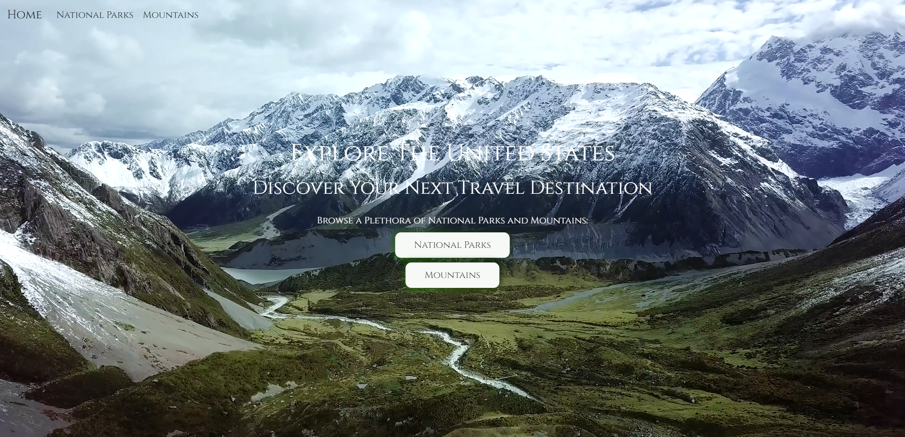
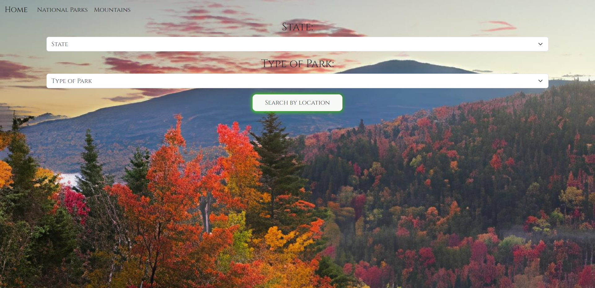
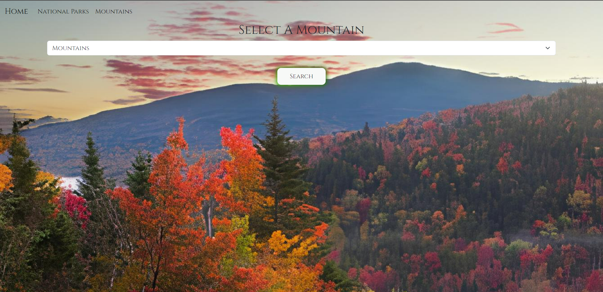

# TravelSiteWebsite/enjoytheoutdoors
 
Enjoy The Outdoors Capstone 2

Description
This website was designed to be a site where people can see many different locations in the United States.
Specifically national parks in U.S states and territories, along with mountains

Installation
Download the zip file

Credits
Used Bootstrap for some designing
Classmate advice/guidance and contribtions
Remsey Mailjard: https://www.linkedin.com/in/remseymailjard/?originalSubdomain=nl

What the Website Should Look Like:

